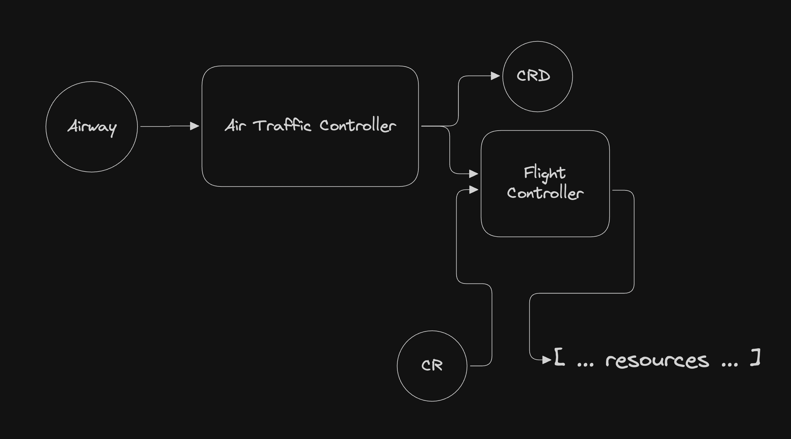

import { Code } from '@astrojs/starlight/components';

## Overview

The Air Traffic Controller (ATC) is a Kubernetes controller that enables the creation of CustomResourceDefinitions (CRDs) and implements them through Yoke flights.

### The Problem with Current Deployment Tools

#### Client-Side Package Managers:

Yoke introduces an innovative "packages as code" model, shareable as WASM executables. However, client-side package managers are limited in Kubernetes environments. These tools:

- Operate outside Kubernetes APIs, deploying resources ad hoc into clusters.
- Fail to track package lifecycles effectively without reliance on resource labels or implementation specific secrets.

Such reliance on tool-specific implementations makes managing packages less transparent and harder to standardize.

#### Limitations of ArgoCD:

Tools like ArgoCD rely on generic container resources (e.g., Argo Applications), which offer flexibility but introduce challenges:

- Permission escalation: Users creating Argo applications, either via `kubectl` or Git commits, can bypass organizational RBAC, effectively assuming Argo's deployment permissions.
- Underuse of Kubernetes API validation: Applications are generic and pass unchecked values to their underlying resource renderer. For example, if using helm, values are unchecked by the kubernetes api and we must rely on chart implementations to validate and surface errors later down the pipeline.
- Lack of specificity: Applications are deployed as generic resources, obscuring their types and requiring labels or naming conventions to organize and filter them.

## Goal of the Air Traffic Controller

The ATC makes package management native to Kubernetes by defining packages as specific, well-structured resources. This approach:

- Utilizes Kubernetes features like OpenAPI validation for robust package definitions.
- Enforces RBAC policies, limiting resource deployment and enhancing security.

By aligning with Kubernetes' native capabilities, ATC improves security, governance, and control over deployments.

## How It Works

The ATC consists of two components: the controller deployment and the Airway CustomResourceDefinition (CRD). An Airway is an API that enables you to define and connect two core elements: a new CRD specification of your creation and its corresponding flight implementation, which is specified as a URL to a WASM executable flight.

The ATC monitors Airways and creates the specified CRD, and spawns Flight Controllers within its process to manage the corresponding CRs. When a CR is created, updated, or modified, the relevant Flight Controller invokes the corresponding WASM flight to compute the desired state of your resources and applies these changes to the cluster.

This design allows you to define custom packages and enables your users to deploy them as native Kubernetes resources.



## How to install the ATC

```bash
# Substitute the following variables as desired for your deployment.
NAMESPACE=atc
VERSION=latest
RELEASE=atc
URL=https://github.com/yokecd/yoke/releases/download/$VERSION/atc-installer.wasm.gz

# Use the yoke cli to deploy the Air Traffic Controller!
yoke takeoff --create-namespace --namespace $NAMESPACE $RELEASE $URL
```

## Getting started

We will be following along with the example found at [https://github.com/yokecd/examples/tree/main/atc](https://github.com/yokecd/examples/tree/main/atc)

To begin we will need two things:

- The definition of our custom resource
- A flight (executable wasm program) to implement our resource as a package

For the sake of example let's assume that for our enterprise we wish to create a package representing a "Backend" or "API" service.

First let's define a Go package containing our new Custom Resource type.

**source:** [atc/backend/v1/backend.go](https://github.com/yokecd/examples/tree/main/atc/backend/v1/backend.go)

<Code lang="go" code={await fetch('https://raw.githubusercontent.com/yokecd/examples/refs/heads/main/atc/backend/v1/backend.go').then(resp => resp.text())} title="backend.go" />

Next we will want to implement a program to transform this resource into an array of resources.

Note that nothing in our example implementation is specific to backends or any type of workload. For this example our package will output the backend as a kubernetes Deployment and Service.

**source:** [atc/backend/v1/flight/main.go](https://github.com/yokecd/examples/tree/main/atc/backend/v1/flight/main.go)

<Code lang="go" code={await fetch('https://raw.githubusercontent.com/yokecd/examples/refs/heads/main/atc/backend/v1/flight/main.go').then(resp => resp.text())} title="flight/main.go" />

The flight executable can now be built via the Go Toolchain:

```bash
GOOS=wasip1 GOARCH=wasm go build ./path/to/main
```

Where and how you choose to host this binary such that it is fetchable by the ATC controller is up to you. Common choices include:

- In a public or private github release
- In an internal service you deploy in your cluster
- Any service that hosts assets for you and allows you to fetch them over http/https.

Since we are following the example from the **yokecd/examples** repository, we will be using the latest github release of this flight: **https://github.com/yokecd/examples/releases/download/latest/atc_backend_v1_flight.wasm.gz**

Now all that's left is to build an Airway using our **v1.Backend** type in conjunction with our Flight. Let's define it in code.

**source:** [atc/backend/airway/main.go](https://github.com/yokecd/examples/tree/main/atc/backend/airway/main.go)

<Code lang="go" code={await fetch('https://raw.githubusercontent.com/yokecd/examples/refs/heads/main/atc/backend/airway/main.go').then(resp => resp.text())} title="airway/main.go" />

With this final piece we have built a flight that installs the Airway that will bind our Backend resource to its implementing flight. Fortunately for the rest of this example, it is also hosted in the github release of our examples repository.

Putting it all together let's install yoke, setup a local cluster, install the atc, install our airway, and finally install our new backend component.

```bash
# install yoke cli
go install github.com/yokecd/yoke/cmd/yoke@latest

# create a local cluster
kind delete cluster && kind create cluster

# install the atc
yoke takeoff -wait 30s --create-namespace --namespace atc atc 'https://github.com/yokecd/yoke/releases/download/latest/atc-installer.wasm.gz'

# install the yokcd/examples Backend-Airway
yoke takeoff -wait 30s backendairway "https://github.com/yokecd/examples/releases/download/latest/atc_backend_airway.wasm.gz"

# You are done! You can now create Backends!
kubectl apply -f - <<EOF
apiVersion: examples.com/v1
kind: Backend
metadata:
  name: nginx
spec:
  image: nginx:latest
  replicas: 2
EOF
```

## Flight Overrides

Generally, the custom resources we create do not expose flight implementation details. Users can create resources without being aware of the underlying implementation details of the CRD.

However, this abstraction can pose challenges during flight development, as Airways only accept a single _Flight Module URL_. Any changes to the flight implementation will update all custom resources associated with that airway.

During flight development, you may want to test a new implementation in production with a non-critical application as a canary.

To enable resource-specific flight implementation updates, you can override the flight URL using the following annotation: **overrides.yoke.cd/flight: &lt;url&gt;**.

The ATC will use the module located at the specified URL and apply it to the custom resource. For example, you can add the annotation as shown below:

```bash
kubectl apply -f - <<EOF 
apiVersion: examples.com/v1 
kind: Backend
metadata: 
  name: nginx 
  annotations: 
    overrides.yoke.cd/flight: http://path/to/development/module.wasm 
spec: ... 
EOF
```

The development module is not cached, as it is assumed to be neither stable nor versioned. This allows you to iterate on the module by updating its source without changing the URL. However, this also means that overrides are not recommended for production use. They are significantly less performant than standard modules because each update forces the ATC to download and compile the WASM module.

## Conversion Webhooks via Converter Wasm Programs

Airways describe the `CustomResourceDefinition` you wish to create. Therefore, it is best to follow the recommended best practices outlined in the official Kubernetes documentation: [Versions in CustomResourceDefinitions](https://kubernetes.io/docs/tasks/extend-kubernetes/custom-resources/custom-resource-definition-versioning/).

- Avoid breaking changes.
- Use [conversion webhooks](https://kubernetes.io/docs/tasks/extend-kubernetes/custom-resources/custom-resource-definition-versioning/#webhook-conversion) to translate between different versions of your `CustomResource`.

Setting up your own Conversion Webhook Server and deploying it to support breaking changes for your APIs can be cumbersome. To simplify the process of evolving your Airways and APIs over time, the ATC supports conversion webhooks for Airways that specify a converter Wasm executable.

```yaml
apiVersion: yoke.cd/v1alpha1
kind: Airway
metadata:
  name: example
spec:
  wasmUrls:
    flight: http://wasmcache/example.flight.wasm.gz
    # Specifying a converter enables the ATC to handle conversion webhooks for our custom resource.
    converter: http://wasmcache/example.converter.wasm.gz
  template:
    # crd definition
```

A converter program reads a conversion review object, as defined in the conversion webhook [documentation](https://kubernetes.io/docs/tasks/extend-kubernetes/custom-resources/custom-resource-definition-versioning/#webhook-conversion), from standard input and writes the resulting conversion review, with the conversion response populated, back to standard output.

An example conversion program written in Go can be found within the [yoke](https://github.com/yokecd/yoke) project [here](https://github.com/yokecd/yoke/blob/56a7bbced2aff4a3862a95b609bf49732a455ae0/cmd/atc/internal/testing/apis/backend/converter/main.go#L1-L179).


## Using Private Flights

Private flights are backed by Container Registries, and yoke uses docker credentials in order to authenticate to them.
To authenticate the Air Traffic Controller to a container registry follow these steps:

- Create a docker-registry type secret in the same namespace as the ATC
- Provide secret's name as the `dockerConfigSecretName` to the atc-installer when installing or updating the ATC.
- You can now create Airways with flights pointing to authenticated registries.

Example:

```bash
# Generate the basic auth required for your registry
AUTH=$(echo -n ${USERNAME}:${PASSWORD} | base64)

# Create the configuration file. This can also be created via other means.
# This is just a simple example, but as long as you create a valid docker configuration that does not depend
# on your local credential store, it will work.
cat <<EOF
{
  "auths": {
    "$REGISTRY": {
      "auth": "$AUTH"
    }
  }
} > config.json
EOF

# Create a docker-registry secret from the docker config we generated. 
# Here it is called "registry" but you can choose any name you see fit.
kubectl create secret docker-registry registry --from-file=config.json

# Install or update the ATC passing the secret name as an option.
# Make sure that the secret and the ATC are deployed in the same namespace.
yoke takeoff atc 'https://github.com/yokecd/yoke/releases/download/latest/atc-installer.wasm.gz' <<EOF
dockerConfigSecretName: registry
EOF
```
